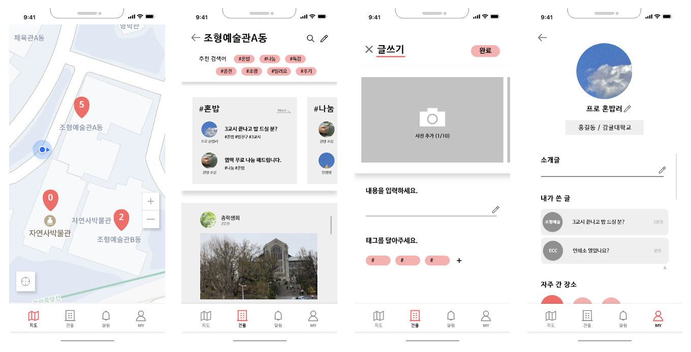

# moveon

**: 대학생들을 위한 커뮤니티. 특정 장소(건물)에 위치해 있는 사람끼리 커뮤니티 형성.**

**🤓 역할 : iOS 개발**

**🗓 기간 : 2021.12 ~**

**📖 개발 내용 :**

- Access token, Refresh token을 이용한 이메일 로그인 + KeyChain에 token 저장
- Alamofire 이용해서 서버와 통신
- 네이버 지도로 사용자 위치 표시
- 사진첩에서 사진 가져오기
- 커뮤니티 피드, 마이 페이지 등 UI 작업

**✔️ 앱 기능 및 작동 방식**

- 앱에 접속하면 자신의 위치를 볼 수 있다.
- 커뮤니티 탭에 들어가면 해당 건물에 있는 사람들의 게시물을 볼 수 있다.
- 사용자의 위치를 기반으로 같은 건물에 있는 사람들과 익명으로 소통할 수 있다.

